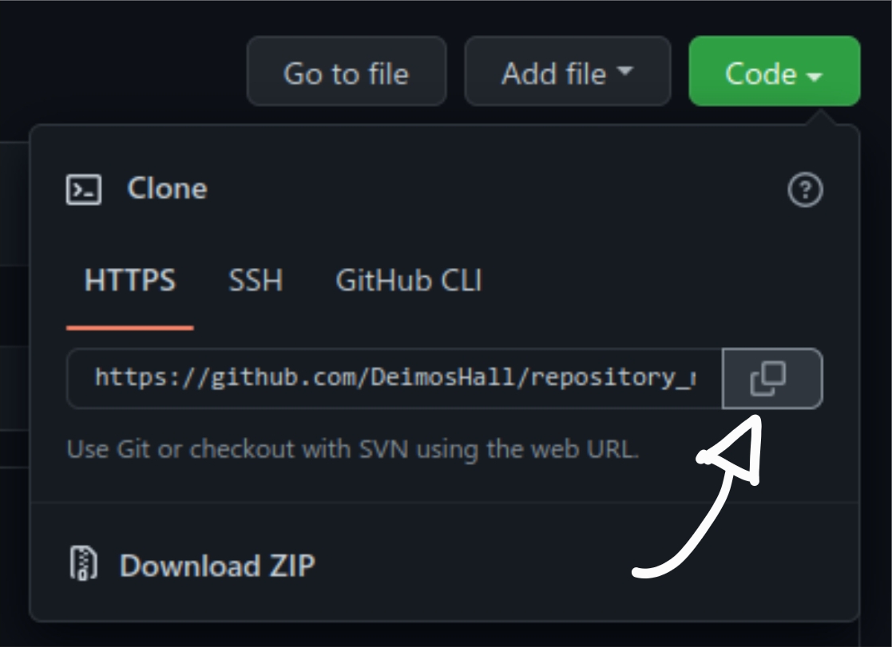

# Just a simple android calculator

The app appearance in light and dark mode is as follows

	

## How to clone a repository into Android Studio
1.- First you have to copy the link, click on code and later on the copy button.

	

2.- Now open Android Studio in the main screen and click on Get from VCS.

	

3.- Paste the link as the URL and click on Clone.

	

> NOTE: Gradle will probably download dependencies, so you need to wait until you see the project tree as the Android view instead of the Project one.

	

